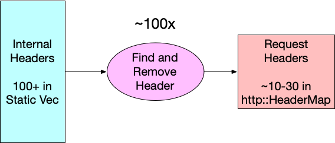
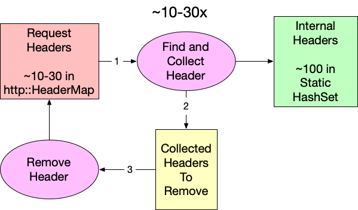
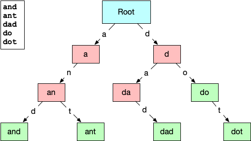

<!-- https://blog.cloudflare.com/pingora-saving-compute-1-percent-at-a-time/ -->

# A good day to trie-hard: saving compute 1% at a time


Cloudflare’s global network handles a lot of HTTP requests – over 60 million per second on average. That in and of itself is not news, but it is the starting point to an adventure that started a few months ago and ends with the announcement of a new [open-source Rust crate](https://github.com/cloudflare/trie-hard) that we are using to reduce our CPU utilization, enabling our CDN to handle even more of the world’s ever-increasing Web traffic.

## Motivation

Let’s start at the beginning. You may recall a few months ago we released [Pingora](https://blog.cloudflare.com/pingora-open-source/) (the heart of our Rust-based proxy services) as [an open-source project on GitHub](https://github.com/cloudflare/pingora). I work on the team that maintains the Pingora framework, as well as Cloudflare’s production services built upon it. One of those services is responsible for the final step in transmitting users’ (non-cached) requests to their true destination. Internally, we call the request’s destination server its “origin”, so our service has the (unimaginative) name of “pingora-origin”.

One of the many responsibilities of pingora-origin is to ensure that when a request leaves our infrastructure, it has been cleaned to remove the internal information we use to route, measure, and optimize traffic for our customers. This has to be done for every request that leaves Cloudflare, and as I mentioned above, it’s a lot of requests. At the time of writing, the rate of requests leaving pingora-origin (globally) is 35 million requests per second. Any code that has to be run per-request is in the hottest of hot paths, and it’s in this path that we find this code and comment:

```rust
// PERF: heavy function: 1.7% CPU time
pub fn clear_internal_headers(request_header: &mut RequestHeader) {
    INTERNAL_HEADERS.iter().for_each(|h| {
        request_header.remove_header(h);
    });
}
```

This small and pleasantly-readable function consumes more than 1.7% of pingora-origin’s total cpu time. To put that in perspective, the total cpu time consumed by pingora-origin is 40,000 compute-seconds per second. You can think of this as 40,000 saturated CPU cores fully dedicated to running pingora-origin. Of those 40,000, 1.7% (680) are only dedicated to evaluating `clear_internal_headers`. The function’s heavy usage and simplicity make it seem like a great place to start optimizing.

## Benchmarking

Benchmarking the function shown above is straightforward because we can use the wonderful [criterion](https://crates.io/crates/criterion) Rust crate. Criterion provides an api for timing rust code down to the nanosecond by aggregating multiple isolated executions. It also provides feedback on how the performance improves or regresses over time. The input for the benchmark is a large set of synthesized requests with a random number of headers with a uniform distribution of internal vs. non-internal headers. With our tooling and test data we find that our original clear_internal_headers function runs in an average of 3.65µs. Now for each new method of clearing headers, we can measure against the same set of requests and get a relative performance difference.

## Reducing Reads

One potentially quick win is to invert how we find the headers that need to be removed from requests. If you look at the original code, you can see that we are evaluating request_header.remove_header(h) for each header in our list of internal headers, so 100+ times. Diagrammatically, it looks like this:



Since an average request has significantly fewer than 100 headers (10-30), flipping the lookup direction should reduce the number of reads while yielding the same intersection. Because we are working in Rust (and because `retain` does not exist for `http::HeaderMap` [yet](https://github.com/hyperium/http/issues/541)), we have to collect the identified internal headers in a separate step before removing them from the request. Conceptually, it looks like this:



Using our benchmarking tool, we can measure the impact of this small change, and surprisingly this is already a substantial improvement. The runtime improves from `3.65µs` to `1.53µs`. That’s a 2.39x speed improvement for our function. We can calculate the theoretical CPU percentage by multiplying the starting utilization by the ratio of the new and old times: 1.71% \* 1.53 / 3.65 = 0.717%. Unfortunately, if we subtract that from the original 1.71% that only equates to saving 1.71% - 0.717% = 0.993% of the total CPU time. We should be able to do better.

## Searching Data Structures

Now that we have reorganized our function to search a static set of internal headers instead of the actual request, we have the freedom to choose what data structure we store our header name in simply by changing the type of `INTERNAL_HEADER_SET`.

```rust
pub fn clear_internal_headers(request_header: &mut RequestHeader) {
   let to_remove = request_header
       .headers
       .keys()
       .filter_map(|name| INTERNAL_HEADER_SET.get(name))
       .collect::<Vec<_>>();


   to_remove.into_iter().for_each(|k| {
       request_header.remove_header(k);
   });
```

Our first attempt used `std::HashMap`, but there may be other data structures that better suit our needs. All computer science students were taught at some point that hash tables are great because they have constant-time asymptotic behavior, or O(1), for reading. (If you are not familiar with [big O notation](https://www.khanacademy.org/computing/computer-science/algorithms/asymptotic-notation/a/big-o-notation), it is a way to express how an algorithm consumes a resource, in this case time, as the input size changes.) This means no matter how large the map gets, reads always take the same amount of time. Too bad this is only partially true. In order to read from a hash table, you have to compute the hash. Computing a hash for strings requires reading every byte, so while read time for a hashmap is constant over the table’s size, it’s linear over key length. So, our goal is to find a data structure that is better than O(L) where L is the length of the key.

There are a few common data structures that provide for reads that have read behavior that meets our criteria. Sorted sets like BTreeSet use comparisons for searching, and that makes them logarithmic over key length `O(log(L))`, but they are also logarithmic in size too. The net effect is that even very fast sorted sets like [FST](https://crates.io/crates/fst) work out to be a little (50 ns) slower in our benchmarks than the standard hashmap.

State machines like parsers and regex are another common tool for searching for strings, though it’s hard to consider them data structures. These systems work by accepting input one unit at a time and determining on each step whether or not to keep evaluating. Being able to make these determinations at every step means state machines are very fast to identify negative cases (i.e. when a string is not valid or not a match). This is perfect for us because only one or two headers per request on average will be internal. In fact, benchmarking an implementation of clear_internal_headers using regular expressions clocks in as taking about twice as long as the hashmap-based solution. This is impressively fast given that regexes, while powerful, aren't known for their raw speed. This approach feels promising – we just need something in between a data structure and a state machine.

That’s where the trie comes in.

## Don’t Just Trie

A [trie](https://en.wikipedia.org/wiki/Trie) (pronounced like “try” or “tree”) is a type of [tree data structure](<https://en.wikipedia.org/wiki/Tree_(data_structure)>) normally used for prefix searches or auto-complete systems over a known set of strings. The structure of the trie lends itself to this because each node in the trie represents a substring of characters found in the initial set. The connections between the nodes represent the characters that can follow a prefix. Here is a small example of a trie built from the words: “and”, “ant”, “dad”, “do”, & “dot”.



The root node represents an empty string prefix, so the two lettered edges directed out of it are the only letters that can appear as the first letter in the list of strings, “a” and “d”. Subsequent nodes have increasingly longer prefixes until the final valid words are reached. This layout should make it easy to see how a trie could be useful for quickly identifying strings that are not contained. Even at the root node, we can eliminate any strings that are presented that do not start with “a” or “d”. This paring down of the search space on every step gives reading from a trie the `O(log(L))` we were looking for … but only for misses. Hits within a trie are still `O(L)`, but that’s okay, because we are getting misses over 90% of the time.

Benchmarking a few trie implementations from [crates.io](https://crates.io/search?q=trie) was disheartening. Remember, most tries are used in response to keyboard events, so optimizing them to run in the hot path of tens of millions of requests per second is not a priority. The fastest existing implementation we found was [radix_trie](https://crates.io/crates/radix_trie), but it still clocked in at a full microsecond slower than hashmap. The only thing left to do was write our own implementation of a trie that was optimized for our use case.

## Trie Hard

And we did! Today we are announcing [trie-hard](https://github.com/cloudflare/trie-hard). The repository gives a full description of how it works, but the big takeaway is that it gets its speed from storing node relationships in the bits of unsigned integers and keeping the entire tree in a contiguous chunk of memory. In our benchmarks, we found that trie-hard reduced the average runtime for clear_internal_headers to under a microsecond (0.93µs). We can reuse the same formula from above to calculate the expected CPU utilization for trie-hard to be 1.71% \* 3.65 / 0.93 = 0.43% That means we have finally achieved and surpassed our goal by reducing the compute utilization of pingora-origin by 1.71% - 0.43% = 1.28%!

Up until now we have been working only in theory and local benchmarking. What really matters is whether our benchmarking reflects real-life behavior. Trie-hard has been running in production since July 2024, and over the course of this project we have been collecting performance metrics from the running production of pingora-origin using a statistical sampling of its stack trace over time. Using this technique, the CPU utilization percentage of a function is estimated by the percent of samples in which the function appears. If we compare the sampled performance of the different versions of clear_internal_headers, we can see that the results from the performance sampling closely match what our benchmarks predicted.

| Implementation | Stack trace samples containing clear_internal_headers | Actual CPU Usage (%) | Predicted CPU Usage (%) |
| -------------- | ----------------------------------------------------- | -------------------- | ----------------------- |
| Original       | 19 / 1111                                             | 1.71                 | n/a                     |
| Hashmap        | 9 / 1103                                              | 0.82                 | 0.72                    |
| trie-hard      | 4 / 1171                                              | 0.34                 | 0.43                    |

## Conclusion

Optimizing functions and writing new data structures is cool, but the real conclusion for this post is that knowing where your code is slow and by how much is more important than how you go about optimizing it. Take a moment to thank your observability team (if you're lucky enough to have one), and make use of flame graphs or any other profiling and benchmarking tool you can. Optimizing operations that are already measured in microseconds may seem a little silly, but these small improvements add up.
